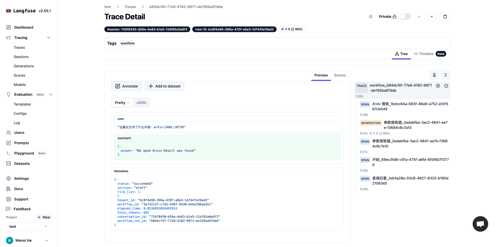

# Langfuseの統合

### 1 Langfuseとは何か

Langfuseは、オープンソースのLLM（大規模言語モデル）エンジニアリングプラットフォームであり、チームがアプリケーションのデバッグ、分析、反復を協力して行うための支援を提供します。


Langfuseの公式サイト紹介：[https://langfuse.com/](https://langfuse.com/)


***

### 2 Langfuseの設定方法

1. [公式サイト](https://langfuse.com/)で.Langfuseに登録しログインします。
2. Langfuse内で[プロジェクト]を作成し、ログイン後にホームページで **New** をクリックして、自分の[プロジェクト]を作成します。[プロジェクト]は、Dify内の[アプリケーション]とデータモニタリングを関連付けるために使われます。

<figure><figcaption>
Langfuse内でプロジェクトを作成する
</figcaption></figure>

プロジェクトに名前を編集します。

<figure><figcaption>
Langfuse内でプロジェクトを作成する
</figcaption></figure>

3. [プロジェクトAPIクレデンシャル]を作成します。プロジェクト内の左側のサイドバーで **[設定]** をクリックして設定を開きます。

<figure><figcaption>
プロジェクトAPIクレデンシャルを作成する
</figcaption></figure>

[設定]内で **Create API Keys** をクリックしてプロジェクトAPIクレデンシャルを作成します。

<figure><figcaption>
プロジェクトAPIクレデンシャルを作成する
</figcaption></figure>

**シークレットキー**、**パブリックキー**、**ホスト**をコピーし保存します。

<figure><figcaption>
APIキー設定を取得する
</figcaption></figure>

4\. Dify内でLangfuseを設定します。監視する[アプリケーション]を開きます。サイドバーのメニューから**モニタリング**を開き、ページ内で**設定**を選択します。

<figure><figcaption>
Langfuseを設定する
</figcaption></figure>

設定をクリック後、Langfuse内で作成した **シークレットキー、パブリックキー、ホスト** を設定に貼り付け保存します。

<figure><figcaption>
Langfuseを設定する
</figcaption></figure>

成功して保存すると、現在のページで状態を確認でき、起動中としてモニタリングが進行中であることが表示されます。

<figure><figcaption>
設定状態を確認する
</figcaption></figure>

***

### 3 Langfuse内でモニタリングデータを確認する

設定が完了すると、Dify内の[アプリケーション]のデバッグやプロダクションデータは、Langfuseでモニタリングデータを確認できます。

<figure><figcaption>
Dify内でアプリケーションをデバッグする
</figcaption></figure>

<figure><figcaption>
Langfuse内でアプリケーションデータを確認する
</figcaption></figure>

<figure><figcaption>
Langfuse内でアプリケーションデータを確認する
</figcaption></figure>

<Terms>
{Langfuse} -> {Langfuse}
{オープンソース} -> {オープンソース}
{LLM (Large Language Model)} -> {大規模言語モデル}
{エンジニアリングプラットフォーム} -> {エンジニアリングプラットフォーム}
{チームコラボレーション} -> {チームコラボレーション}
{デバッグ} -> {デバッグ}
{分析} -> {分析}
{反復} -> {反復}
{アプリケーション} -> {アプリケーション}
{公式サイト} -> {公式サイト}
{登録} -> {登録}
{ログイン} -> {ログイン}
{プロジェクト} -> {プロジェクト}
{データモニタリング} -> {データモニタリング}
{API クレデンシャル} -> {API クレデンシャル}
{設定} -> {設定}
{シークレットキー} -> {シークレットキー}
{パブリックキー} -> {パブリックキー}
{ホスト} -> {ホスト}
{保存} -> {保存}
{モニタ